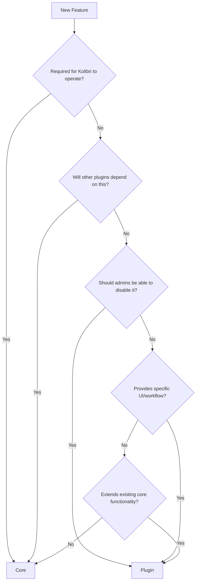

Kolibri's behavior can be extended using plugins. The plugin system allows administrators to enable or disable features, making Kolibri adaptable to different deployment scenarios.

## Plugin Architecture

### KolibriPluginBase

Every plugin must subclass `KolibriPluginBase` and define a `kolibri_plugin` module:

```python
from kolibri.plugins import KolibriPluginBase

class ExamplePlugin(KolibriPluginBase):
    untranslated_view_urls = "api_urls"
    translated_view_urls = "urls"
    kolibri_options = "options"
    can_manage_while_running = True
    
    def name(self, lang):
        with translation.override(lang):
            return _("Example Plugin")
```

### Plugin Properties

#### URL Configuration

- **`untranslated_view_urls`**: Module containing API URL patterns (no language prefix)
- **`translated_view_urls`**: Module containing UI URL patterns (with language prefix)
- **`root_view_urls`**: Module for URLs attached to domain root (use with caution)

```python
# api_urls.py (untranslated)
from django.urls import path
from .api import MyViewSet

urlpatterns = [
    path('data/', MyViewSet.as_view({'get': 'list'})),
]
```

#### Settings and Options

- **`django_settings`**: Module exposing additional Django settings
- **`kolibri_options`**: Module with `option_spec` for plugin-specific configuration
- **`kolibri_option_defaults`**: Module to override default values of core options

```python
# options.py
option_spec = {
    "Server": {
        "MY_PLUGIN_SETTING": {
            "type": "boolean",
            "default": False,
        }
    }
}
```

#### Management Properties

- **`can_manage_while_running`**: Whether the plugin can be enabled/disabled via GUI while Kolibri is running

### Singleton Pattern

All plugin classes use a singleton pattern (via `SingletonMeta`), ensuring only one instance exists:

```python
class SingletonMeta(ABCMeta):
    _instances = {}

    def __call__(cls, *args, **kwargs):
        if cls not in cls._instances:
            cls._instances[cls] = super().__call__(*args, **kwargs)
        return cls._instances[cls]

class KolibriPluginBase(metaclass=SingletonMeta):
    """Base class for all Kolibri plugins"""
    pass
```

## Core vs. Plugins Decision Guide

Understanding when to add code to core versus plugins is crucial:

### Use Core When:

1. Functionality is fundamental to Kolibri's operation
2. Code provides shared infrastructure used across multiple plugins
3. Code defines base models, APIs, or utilities that plugins extend
4. Feature cannot be disabled without breaking Kolibri

**Core Examples:**

- `kolibri.core.auth`: User authentication and permissions
- `kolibri.core.content`: Content channel and metadata management
- `kolibri.core.logger`: Event logging and analytics
- `kolibri.core.tasks`: Background task queue
- `kolibri.core.device`: Device-level settings and management

### Use Plugins When:

1. Feature can be optionally enabled/disabled by administrators
2. Code provides a specific user interface or workflow
3. Feature is self-contained with minimal dependencies on other plugins
4. Different deployments might want different combinations of features

**Plugin Examples:**

- `kolibri.plugins.learn`: Learner interface for browsing and accessing content
- `kolibri.plugins.coach`: Coach tools for managing classes and assignments
- `kolibri.plugins.facility`: Facility management and user administration
- `kolibri.plugins.device`: Device configuration interface

### Decision Flowchart



## Managing Plugins

### Enabling Plugins

Enable one or more plugins:

```bash
kolibri plugin enable kolibri.plugins.example_plugin
kolibri plugin enable kolibri.plugins.learn kolibri.plugins.coach
```

### Disabling Plugins

Disable a plugin:

```bash
kolibri plugin disable kolibri.plugins.example_plugin
```

### Setting Exact Plugin List

Disable all plugins except the specified ones:

```bash
kolibri plugin apply kolibri.plugins.learn kolibri.plugins.default_theme
```

### Environment Variables

Override plugin configuration via environment variables:

```bash
# Apply specific plugins (overrides plugins.json)
KOLIBRI_PLUGIN_APPLY=kolibri.plugins.learn,kolibri.plugins.coach

# Enable additional plugins
KOLIBRI_PLUGIN_ENABLE=kolibri.plugins.custom_plugin

# Disable specific plugins
KOLIBRI_PLUGIN_DISABLE=kolibri.plugins.facility
```

<Warning>
After enabling or disabling plugins, restart Kolibri for changes to take effect.
</Warning>

## Plugin Configuration Storage

Plugins are configured in `KOLIBRI_HOME/plugins.json`:

```json
{
  "DISABLED_PLUGINS": [],
  "INSTALLED_PLUGINS": [
    "kolibri.plugins.learn",
    "kolibri.plugins.coach",
    "kolibri.plugins.facility"
  ],
  "PLUGIN_VERSIONS": {
    "kolibri.plugins.learn": "0.15.0"
  },
  "UPDATED_PLUGINS": []
}
```

The `ConfigDict` class manages this configuration:

```python
class ConfigDict(dict):
    SET_KEYS = ("INSTALLED_PLUGINS", "DISABLED_PLUGINS", "UPDATED_PLUGINS")
    
    @property
    def ACTIVE_PLUGINS(self):
        if self.ENV_VAR_APPLIED_PLUGINS:
            return self.ENV_VAR_APPLIED_PLUGINS
        return list(
            (self["INSTALLED_PLUGINS"] - self["DISABLED_PLUGINS"]).union(
                self.ENV_VAR_ENABLED_PLUGINS
            )
            - self.ENV_VAR_DISABLED_PLUGINS
        )
```

## Creating a Plugin

### Project Structure

A typical plugin structure:

```text
kolibri/plugins/example_plugin/
├── __init__.py
├── kolibri_plugin.py          # Plugin definition
├── api_urls.py                # API URL patterns
├── urls.py                    # UI URL patterns
├── options.py                 # Plugin options
├── settings.py                # Django settings
├── api.py                     # ViewSets and API logic
├── models.py                  # Database models (if needed)
├── frontend/                  # Frontend code
│   ├── app.js                 # Entry point
│   ├── views/                 # Vue components
│   ├── composables/           # Composition API composables
│   ├── routes/                # Vue Router routes
│   └── __tests__/             # Frontend tests
└── test/                      # Backend tests
    ├── test_api.py
    └── test_models.py
```

### Example: Learn Plugin

The Learn plugin demonstrates best practices:

```python
from kolibri.plugins import KolibriPluginBase
from kolibri.core.hooks import NavigationHook
from kolibri.core.webpack import hooks as webpack_hooks
from kolibri.plugins.hooks import register_hook

class Learn(KolibriPluginBase):
    untranslated_view_urls = "api_urls"
    translated_view_urls = "urls"
    kolibri_options = "options"
    can_manage_while_running = True

    def name(self, lang):
        with translation.override(lang):
            return _("Learn")

@register_hook
class LearnAsset(webpack_hooks.WebpackBundleHook):
    bundle_id = "app"

    @property
    def plugin_data(self):
        return {
            "allowGuestAccess": get_device_setting("allow_guest_access"),
            "allowLearnerDownloads": get_device_setting(
                "allow_learner_download_resources"
            ),
        }

@register_hook
class LearnNavItem(NavigationHook):
    bundle_id = "side_nav"
```

<Info>
Plugins are automatically added to Django's `INSTALLED_APPS` when enabled, so they work like standard Django apps.
</Info>

## Frontend Integration

Plugins can define frontend bundles using hooks:

```python
@register_hook
class MyPluginAsset(webpack_hooks.WebpackBundleHook):
    bundle_id = "app"
    
    @property
    def plugin_data(self):
        """Data passed to frontend bundle"""
        return {
            "apiUrl": reverse("kolibri:myplugin:api-root"),
            "enableFeature": get_device_setting("my_feature"),
        }
```

The corresponding `app.js` entry point:

```javascript
import RootVue from './views/MyPluginIndex';
import KolibriModule from 'kolibri_module';

class MyPluginModule extends KolibriModule {
  ready() {
    this.rootvue = new RootVue({
      el: '#app',
    });
  }
}

export default new MyPluginModule();
```

## External Plugins with PEX

When using externally-built plugins with a PEX distribution:

```bash
# Allow PEX to access system-installed plugins
PEX_INHERIT_PATH=fallback python kolibri.pex start
```

<Warning>
External plugins must be installed via `pip install` in the system Python path before using with PEX.
</Warning>

## Plugin Hooks

Plugins can register hooks to extend Kolibri behavior:

- **NavigationHook**: Add items to navigation menus
- **WebpackBundleHook**: Define frontend asset bundles
- **RoleBasedRedirectHook**: Configure role-based redirects
- **ContentNodeDisplayHook**: Customize content node display

See the `kolibri.plugins.hooks` module and individual hook classes for more details.

## Best Practices

<AccordionGroup>
  <Accordion title="Keep plugins self-contained">
    Minimize dependencies on other plugins. Use core modules for shared functionality.
  </Accordion>
  
  <Accordion title="Use proper URL namespacing">
    Plugin URLs are automatically namespaced: `reverse('kolibri:mypluginclass:url_name')`
  </Accordion>
  
  <Accordion title="Document plugin options">
    Provide clear documentation for any plugin-specific configuration options.
  </Accordion>
  
  <Accordion title="Test plugin enable/disable">
    Ensure your plugin can be safely enabled and disabled without breaking other functionality.
  </Accordion>
</AccordionGroup>

## Next Steps

<CardGroup cols={2}>
  <Card title="Architecture Overview" icon="building" href="/concepts/architecture">
    Learn about Kolibri's overall architecture
  </Card>
  <Card title="Frontend Development" icon="code" href="/guides/frontend-development">
    Understand frontend plugin development
  </Card>
  <Card title="Backend Development" icon="server" href="/guides/backend-development">
    Learn backend development patterns
  </Card>
  <Card title="Testing Guide" icon="flask" href="/guides/testing">
    Write tests for your plugin
  </Card>
</CardGroup>
